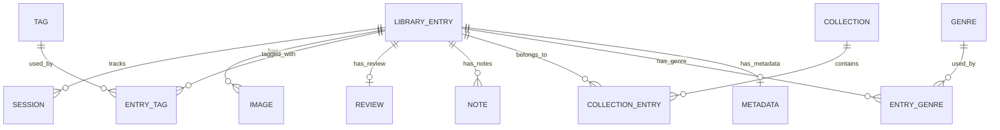

# Database Design
## Vazorism · SQLite Schema via Prisma

---

## 1. Overview

All data is stored in a single SQLite database at `%APPDATA%/vazorism/vazorism.db`. Prisma is used for schema management, migrations, and type-safe queries.

### Design Principles
- **Normalized** — No duplicate data across tables
- **Referential integrity** — Foreign keys enforced
- **Indexed** — All frequently queried columns indexed
- **Timestamps** — `created_at` and `updated_at` on every table
- **Soft deletes** — Critical data uses `deleted_at` instead of hard delete

---

## 2. Entity Relationship Diagram



---

## 3. Schema Definition

### 3.1 Library Entry (Core)

The central entity — every game or application has one `LibraryEntry`.

```prisma
model LibraryEntry {
  id            String   @id @default(uuid())
  title         String
  type          String   @default("game")      // "game" | "application"
  status        String   @default("unplayed")  // "playing" | "completed" | "backlog" | "dropped" | "wishlist" | "unplayed"
  executablePath String?                        // Path to .exe
  executableName String?                        // e.g. "game.exe"
  rating        Float?                          // User rating 1-10
  favorite      Boolean  @default(false)
  hidden        Boolean  @default(false)
  playtimeTotal Int      @default(0)            // Total effective seconds
  lastPlayedAt  DateTime?
  addedAt       DateTime @default(now())
  createdAt     DateTime @default(now())
  updatedAt     DateTime @updatedAt
  deletedAt     DateTime?

  // Relations
  metadata      Metadata?
  sessions      Session[]
  images        Image[]
  review        Review?
  notes         Note[]
  tags          EntryTag[]
  genres        EntryGenre[]
  collections   CollectionEntry[]

  @@index([title])
  @@index([type])
  @@index([status])
  @@index([lastPlayedAt])
  @@index([playtimeTotal])
  @@index([executableName])
  @@map("library_entries")
}
```

### 3.2 Metadata

Extended metadata fetched from API providers. Separated from `LibraryEntry` to keep the core table lightweight.

```prisma
model Metadata {
  id            String   @id @default(uuid())
  entryId       String   @unique
  description   String?
  developer     String?
  publisher     String?
  releaseDate   DateTime?
  platforms     String?                         // JSON array: ["PC", "PS5", "Xbox"]
  igdbId        Int?
  rawgId        Int?
  steamAppId    Int?
  igdbRating    Float?
  rawgRating    Float?
  metacriticScore Int?
  source        String?                         // Which provider supplied this data
  fetchedAt     DateTime @default(now())
  createdAt     DateTime @default(now())
  updatedAt     DateTime @updatedAt

  // Relations
  entry         LibraryEntry @relation(fields: [entryId], references: [id], onDelete: Cascade)

  @@index([igdbId])
  @@index([rawgId])
  @@index([steamAppId])
  @@map("metadata")
}
```

### 3.3 Session

Individual play/usage sessions with idle tracking.

```prisma
model Session {
  id              String   @id @default(uuid())
  entryId         String
  startedAt       DateTime
  endedAt         DateTime?
  durationSeconds Int      @default(0)          // Total wall clock seconds
  effectiveSeconds Int     @default(0)          // Playtime minus idle
  idleSeconds     Int      @default(0)          // Time spent idle
  isActive        Boolean  @default(true)       // Currently running?
  processId       Int?                          // OS process ID
  createdAt       DateTime @default(now())
  updatedAt       DateTime @updatedAt

  // Relations
  entry           LibraryEntry @relation(fields: [entryId], references: [id], onDelete: Cascade)

  @@index([entryId])
  @@index([startedAt])
  @@index([isActive])
  @@map("sessions")
}
```

### 3.4 Image

Cached images for library entries. Multiple images per entry (cover, hero, logo, screenshots).

```prisma
model Image {
  id            String   @id @default(uuid())
  entryId       String
  type          String                          // "cover" | "hero" | "logo" | "screenshot" | "icon"
  localPath     String                          // Relative path within image cache
  remoteUrl     String?                         // Original URL for refresh
  width         Int?
  height        Int?
  sizeBytes     Int?
  isPrimary     Boolean  @default(false)        // Primary image for this type
  createdAt     DateTime @default(now())
  updatedAt     DateTime @updatedAt

  // Relations
  entry         LibraryEntry @relation(fields: [entryId], references: [id], onDelete: Cascade)

  @@index([entryId])
  @@index([type])
  @@unique([entryId, type, isPrimary])
  @@map("images")
}
```

### 3.5 Review

One review per entry. Rich text stored as plain text or markdown.

```prisma
model Review {
  id            String   @id @default(uuid())
  entryId       String   @unique
  content       String                          // Review text (markdown)
  rating        Float?                          // Rating at time of review
  startedDate   DateTime?                       // When user started playing
  finishedDate  DateTime?                       // When user finished
  playedOn      String?                         // Platform played on
  createdAt     DateTime @default(now())
  updatedAt     DateTime @updatedAt

  // Relations
  entry         LibraryEntry @relation(fields: [entryId], references: [id], onDelete: Cascade)

  @@map("reviews")
}
```

### 3.6 Note

Multiple notes per entry, timestamped for journaling.

```prisma
model Note {
  id            String   @id @default(uuid())
  entryId       String
  content       String
  pinned        Boolean  @default(false)
  createdAt     DateTime @default(now())
  updatedAt     DateTime @updatedAt

  // Relations
  entry         LibraryEntry @relation(fields: [entryId], references: [id], onDelete: Cascade)

  @@index([entryId])
  @@map("notes")
}
```

### 3.7 Tag & EntryTag (Many-to-Many)

```prisma
model Tag {
  id            String   @id @default(uuid())
  name          String   @unique
  color         String?                         // Hex color for UI badge
  createdAt     DateTime @default(now())

  // Relations
  entries       EntryTag[]

  @@map("tags")
}

model EntryTag {
  entryId       String
  tagId         String
  createdAt     DateTime @default(now())

  entry         LibraryEntry @relation(fields: [entryId], references: [id], onDelete: Cascade)
  tag           Tag          @relation(fields: [tagId], references: [id], onDelete: Cascade)

  @@id([entryId, tagId])
  @@map("entry_tags")
}
```

### 3.8 Genre & EntryGenre (Many-to-Many)

```prisma
model Genre {
  id            String   @id @default(uuid())
  name          String   @unique
  slug          String   @unique
  createdAt     DateTime @default(now())

  entries       EntryGenre[]

  @@map("genres")
}

model EntryGenre {
  entryId       String
  genreId       String

  entry         LibraryEntry @relation(fields: [entryId], references: [id], onDelete: Cascade)
  genre         Genre        @relation(fields: [genreId], references: [id], onDelete: Cascade)

  @@id([entryId, genreId])
  @@map("entry_genres")
}
```

### 3.9 Collection & CollectionEntry

User-defined playlists or groupings.

```prisma
model Collection {
  id            String   @id @default(uuid())
  name          String
  description   String?
  coverImagePath String?
  sortOrder     Int      @default(0)
  createdAt     DateTime @default(now())
  updatedAt     DateTime @updatedAt

  entries       CollectionEntry[]

  @@map("collections")
}

model CollectionEntry {
  collectionId  String
  entryId       String
  sortOrder     Int      @default(0)
  addedAt       DateTime @default(now())

  collection    Collection   @relation(fields: [collectionId], references: [id], onDelete: Cascade)
  entry         LibraryEntry @relation(fields: [entryId], references: [id], onDelete: Cascade)

  @@id([collectionId, entryId])
  @@map("collection_entries")
}
```

### 3.10 Settings

Key-value store for user preferences.

```prisma
model Setting {
  key           String   @id
  value         String                          // JSON serialized value
  updatedAt     DateTime @updatedAt

  @@map("settings")
}
```

### 3.11 Discovery Cache

Cached discovery content (trending, new releases, etc.).

```prisma
model DiscoveryCache {
  id            String   @id @default(uuid())
  category      String                          // "trending" | "new_releases" | "upcoming" | "top_rated" | "deals"
  data          String                          // JSON serialized response
  fetchedAt     DateTime @default(now())
  expiresAt     DateTime
  createdAt     DateTime @default(now())

  @@unique([category])
  @@index([category])
  @@index([expiresAt])
  @@map("discovery_cache")
}
```

---

## 4. Relationships Summary

| Relationship | Type | Description |
|-------------|------|-------------|
| LibraryEntry → Metadata | 1:1 | Each entry has at most one metadata record |
| LibraryEntry → Session | 1:N | Each entry can have many sessions |
| LibraryEntry → Image | 1:N | Each entry can have multiple images (cover, hero, logo, screenshots) |
| LibraryEntry → Review | 1:1 | Each entry has at most one review |
| LibraryEntry → Note | 1:N | Each entry can have many notes |
| LibraryEntry ↔ Tag | M:N | Entries can have many tags, tags can be on many entries |
| LibraryEntry ↔ Genre | M:N | Entries can have many genres, genres can be on many entries |
| LibraryEntry ↔ Collection | M:N | Entries can be in many collections, collections can have many entries |

---

## 5. Default Settings

```json
{
  "idle_timeout_seconds": 300,
  "process_poll_interval_ms": 3000,
  "excluded_processes": ["explorer.exe", "svchost.exe", "System", "Idle"],
  "excluded_directories": ["C:\\Windows", "C:\\Program Files\\Windows"],
  "metadata_providers": ["igdb", "rawg", "steam", "pcgamingwiki"],
  "image_cache_max_gb": 10,
  "discovery_refresh_interval_minutes": 60,
  "auto_start_with_windows": false,
  "minimize_to_tray": true,
  "start_minimized": false,
  "rating_scale": 10
}
```

---

## 6. Migration Strategy

Prisma handles migrations via `prisma migrate`:

```bash
# Create a migration after schema changes
pnpm prisma migrate dev --name add_collections

# Apply migrations in production (Tauri build)
pnpm prisma migrate deploy
```

For Tauri production builds, migrations are embedded in the binary and applied on first launch.
